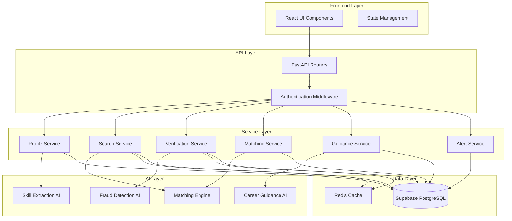

# Internship Discovery & Verification Module - Design Document

## Overview

The Internship Discovery & Verification Module is a comprehensive system that helps students find genuine, skill-aligned, semester-appropriate internships while protecting them from fraudulent listings. The system leverages AI for skill matching, fraud detection, and personalized career guidance.

This module integrates into the existing VidyaMitra platform, utilizing the established FastAPI backend architecture with Google Gemini AI integration and React frontend.

## Architecture

### High-Level Architecture



### Technology Stack

**Backend:**
- FastAPI (Python 3.12+)
- Google Gemini 1.5 Flash (AI/LLM)
- Supabase (PostgreSQL database)
- Redis (caching - optional for MVP)
- Pydantic (data validation)

**Frontend:**
- React 18+
- Vite (build tool)
- Axios (HTTP client)
- React Router (navigation)

**AI/ML:**
- Google Gemini API for NLP tasks
- Rule-based fraud detection
- Hybrid recommendation engine

## Database Schema

### Tables

#### 1. student_profiles
Stores student profile information for personalized recommendations.

```sql
CREATE TABLE student_profiles (
    id UUID PRIMARY KEY DEFAULT uuid_generate_v4(),
    user_id UUID NOT NULL REFERENCES auth.users(id) ON DELETE CASCADE,
    graduation_year INTEGER NOT NULL,
    current_semester INTEGER NOT NULL CHECK (current_semester BETWEEN 1 AND 8),
    degree VARCHAR(50) NOT NULL,
    branch VARCHAR(100) NOT NULL,
    skills TEXT[] NOT NULL DEFAULT '{}',
    preferred_roles TEXT[] NOT NULL DEFAULT '{}',
    internship_type VARCHAR(20) CHECK (internship_type IN ('Remote', 'On-site', 'Hybrid')),
    compensation_preference VARCHAR(20) CHECK (compensation_preference IN ('Paid', 'Unpaid', 'Any')),
    target_companies TEXT[] DEFAULT '{}',
    resume_url TEXT,
    created_at TIMESTAMP WITH TIME ZONE DEFAULT NOW(),
    updated_at TIMESTAMP WITH TIME ZONE DEFAULT NOW(),
    UNIQUE(user_id)
);

CREATE INDEX idx_student_profiles_user_id ON student_profiles(user_id);
CREATE INDEX idx_student_profiles_semester ON student_profiles(current_semester);
CREATE INDEX idx_student_profiles_skills ON student_profiles USING GIN(skills);
```

#### 2. internship_listings
Stores internship opportunities with verification status.

```sql
CREATE TABLE internship_listings (
    id UUID PRIMARY KEY DEFAULT uuid_generate_v4(),
    title VARCHAR(200) NOT NULL,
    company VARCHAR(200) NOT NULL,
    company_domain VARCHAR(200),
    platform VARCHAR(100),
    location VARCHAR(200),
    internship_type VARCHAR(20) CHECK (internship_type IN ('Summer', 'Winter', 'Research', 'Off-cycle')),
    duration VARCHAR(50),
    stipend VARCHAR(100),
    required_skills TEXT[] NOT NULL DEFAULT '{}',
    preferred_skills TEXT[] DEFAULT '{}',
    responsibilities TEXT[] NOT NULL DEFAULT '{}',
    application_deadline DATE,
    start_date DATE,
    verification_status VARCHAR(20) DEFAULT 'Pending' CHECK (verification_status IN ('Verified', 'Use Caution', 'Potential Scam', 'Pending')),
    trust_score INTEGER DEFAULT 0 CHECK (trust_score BETWEEN 0 AND 100),
    red_flags JSONB DEFAULT '[]',
    posted_date DATE DEFAULT CURRENT_DATE,
    is_active BOOLEAN DEFAULT TRUE,
    source_url TEXT,
    created_at TIMESTAMP WITH TIME ZONE DEFAULT NOW(),
    updated_at TIMESTAMP WITH TIME ZONE DEFAULT NOW()
);

CREATE INDEX idx_internship_listings_company ON internship_listings(company);
CREATE INDEX idx_internship_listings_type ON internship_listings(internship_type);
CREATE INDEX idx_internship_listings_status ON internship_listings(verification_status);
CREATE INDEX idx_internship_listings_deadline ON internship_listings(application_deadline);
CREATE INDEX idx_internship_listings_skills ON internship_listings USING GIN(required_skills);
CREATE INDEX idx_internship_listings_active ON internship_listings(is_active) WHERE is_active = TRUE;
```

#### 3. verification_results
Stores detailed verification analysis for internships.

```sql
CREATE TABLE verification_results (
    id UUID PRIMARY KEY DEFAULT uuid_generate_v4(),
    internship_id UUID NOT NULL REFERENCES internship_listings(id) ON DELETE CASCADE,
    status VARCHAR(20) NOT NULL CHECK (status IN ('Verified', 'Use Caution', 'Potential Scam')),
    trust_score INTEGER NOT NULL CHECK (trust_score BETWEEN 0 AND 100),
    verification_signals JSONB NOT NULL DEFAULT '{}',
    red_flags JSONB NOT NULL DEFAULT '[]',
    verification_notes TEXT,
    last_verified TIMESTAMP WITH TIME ZONE DEFAULT NOW(),
    created_at TIMESTAMP WITH TIME ZONE DEFAULT NOW(),
    UNIQUE(internship_id)
);

CREATE INDEX idx_verification_results_internship ON verification_results(internship_id);
CREATE INDEX idx_verification_results_status ON verification_results(status);
```

#### 4. skill_matches
Caches skill matching results for performance.

```sql
CREATE TABLE skill_matches (
    id UUID PRIMARY KEY DEFAULT uuid_generate_v4(),
    user_id UUID NOT NULL REFERENCES auth.users(id) ON DELETE CASCADE,
    internship_id UUID NOT NULL REFERENCES internship_listings(id) ON DELETE CASCADE,
    match_percentage INTEGER NOT NULL CHECK (match_percentage BETWEEN 0 AND 100),
    matching_skills TEXT[] NOT NULL DEFAULT '{}',
    missing_skills TEXT[] NOT NULL DEFAULT '{}',
    learning_path JSONB DEFAULT '[]',
    created_at TIMESTAMP WITH TIME ZONE DEFAULT NOW(),
    UNIQUE(user_id, internship_id)
);

CREATE INDEX idx_skill_matches_user ON skill_matches(user_id);
CREATE INDEX idx_skill_matches_internship ON skill_matches(internship_id);
CREATE INDEX idx_skill_matches_percentage ON skill_matches(match_percentage DESC);
```

#### 5. readiness_scores
Stores readiness assessment for user-internship pairs.

```sql
CREATE TABLE readiness_scores (
    id UUID PRIMARY KEY DEFAULT uuid_generate_v4(),
    user_id UUID NOT NULL REFERENCES auth.users(id) ON DELETE CASCADE,
    internship_id UUID NOT NULL REFERENCES internship_listings(id) ON DELETE CASCADE,
    overall_score INTEGER NOT NULL CHECK (overall_score BETWEEN 0 AND 100),
    resume_strength INTEGER NOT NULL CHECK (resume_strength BETWEEN 0 AND 100),
    skill_match INTEGER NOT NULL CHECK (skill_match BETWEEN 0 AND 100),
    semester_readiness INTEGER NOT NULL CHECK (semester_readiness BETWEEN 0 AND 100),
    recommendation VARCHAR(50) NOT NULL,
    improvement_actions JSONB DEFAULT '[]',
    created_at TIMESTAMP WITH TIME ZONE DEFAULT NOW(),
    updated_at TIMESTAMP WITH TIME ZONE DEFAULT NOW(),
    UNIQUE(user_id, internship_id)
);

CREATE INDEX idx_readiness_scores_user ON readiness_scores(user_id);
CREATE INDEX idx_readiness_scores_internship ON readiness_scores(internship_id);
CREATE INDEX idx_readiness_scores_overall ON readiness_scores(overall_score DESC);
```

#### 6. user_alerts
Stores personalized alerts and notifications.

```sql
CREATE TABLE user_alerts (
    id UUID PRIMARY KEY DEFAULT uuid_generate_v4(),
    user_id UUID NOT NULL REFERENCES auth.users(id) ON DELETE CASCADE,
    internship_id UUID REFERENCES internship_listings(id) ON DELETE CASCADE,
    alert_type VARCHAR(50) NOT NULL CHECK (alert_type IN ('new_match', 'deadline_approaching', 'readiness_improved', 'season_starting')),
    title VARCHAR(200) NOT NULL,
    message TEXT NOT NULL,
    is_read BOOLEAN DEFAULT FALSE,
    created_at TIMESTAMP WITH TIME ZONE DEFAULT NOW()
);

CREATE INDEX idx_user_alerts_user ON user_alerts(user_id);
CREATE INDEX idx_user_alerts_read ON user_alerts(is_read) WHERE is_read = FALSE;
CREATE INDEX idx_user_alerts_created ON user_alerts(created_at DESC);
```

#### 7. scam_reports
Tracks user-reported suspicious listings.

```sql
CREATE TABLE scam_reports (
    id UUID PRIMARY KEY DEFAULT uuid_generate_v4(),
    internship_id UUID NOT NULL REFERENCES internship_listings(id) ON DELETE CASCADE,
    reported_by UUID NOT NULL REFERENCES auth.users(id) ON DELETE CASCADE,
    reason TEXT NOT NULL,
    details TEXT,
    status VARCHAR(20) DEFAULT 'Pending' CHECK (status IN ('Pending', 'Reviewed', 'Confirmed', 'Dismissed')),
    created_at TIMESTAMP WITH TIME ZONE DEFAULT NOW(),
    reviewed_at TIMESTAMP WITH TIME ZONE,
    reviewed_by UUID REFERENCES auth.users(id)
);

CREATE INDEX idx_scam_reports_internship ON scam_reports(internship_id);
CREATE INDEX idx_scam_reports_status ON scam_reports(status);
```

### Database Triggers

```sql
-- Update updated_at timestamp automatically
CREATE OR REPLACE FUNCTION update_updated_at_column()
RETURNS TRIGGER AS $$
BEGIN
    NEW.updated_at = NOW();
    RETURN NEW;
END;
$$ language 'plpgsql';

CREATE TRIGGER update_student_profiles_updated_at BEFORE UPDATE ON student_profiles
    FOR EACH ROW EXECUTE FUNCTION update_updated_at_column();

CREATE TRIGGER update_internship_listings_updated_at BEFORE UPDATE ON internship_listings
    FOR EACH ROW EXECUTE FUNCTION update_updated_at_column();

CREATE TRIGGER update_readiness_scores_updated_at BEFORE UPDATE ON readiness_scores
    FOR EACH ROW EXECUTE FUNCTION update_updated_at_column();
```

## Components and Interfaces

### Backend Components

#### 1. API Routers

**File: `backend/app/routers/internship.py`**

```python
from fastapi import APIRouter, HTTPException, Depends, Query
from typing import List, Optional
from pydantic import BaseModel
from datetime import date

router = APIRouter()

# Request/Response Models
class StudentProfileCreate(BaseModel):
    graduation_year: int
    current_semester: int
    degree: str
    branch: str
    skills: List[str]
    preferred_roles: List[str]
    internship_type: str
    compensation_preference: str
    target_companies: Optional[List[str]] = []
    resume_url: Optional[str] = None

class InternshipSearchRequest(BaseModel):
    skills: Optional[List[str]] = None
    roles: Optional[List[str]] = None
    internship_type: Optional[str] = None
    compensation: Optional[str] = None
    location: Optional[str] = None
    min_match_percentage: Optional[int] = 0

class ScamReportRequest(BaseModel):
    internship_id: str
    reason: str
    details: Optional[str] = None

# Endpoints
@router.post("/profile")
async def create_or_update_profile(profile: StudentProfileCreate, current_user: dict = Depends(get_current_user))
    """Create or update student profile"""

@router.get("/profile")
async def get_profile(current_user: dict = Depends(get_current_user))
    """Get current user's profile"""

@router.get("/calendar")
async def get_internship_calendar(current_user: dict = Depends(get_current_user))
    """Get personalized internship calendar based on semester"""

@router.post("/search")
async def search_internships(request: InternshipSearchRequest, current_user: dict = Depends(get_current_user))
    """Search internships with filters and skill matching"""

@router.get("/{internship_id}")
async def get_internship_details(internship_id: str, current_user: dict = Depends(get_current_user))
    """Get detailed internship information"""

@router.get("/{internship_id}/verify")
async def verify_internship(internship_id: str, current_user: dict = Depends(get_current_user))
    """Get verification status and fraud analysis"""

@router.post("/{internship_id}/match")
async def calculate_skill_match(internship_id: str, current_user: dict = Depends(get_current_user))
    """Calculate skill match percentage and identify gaps"""

@router.get("/{internship_id}/guidance")
async def get_career_guidance(internship_id: str, current_user: dict = Depends(get_current_user))
    """Get AI-powered career guidance for internship"""

@router.get("/{internship_id}/readiness")
async def calculate_readiness_score(internship_id: str, current_user: dict = Depends(get_current_user))
    """Calculate readiness score and recommendations"""

@router.post("/report-scam")
async def report_scam(report: ScamReportRequest, current_user: dict = Depends(get_current_user))
    """Report suspicious internship listing"""

@router.get("/alerts")
async def get_user_alerts(limit: int = Query(20, le=100), current_user: dict = Depends(get_current_user))
    """Get personalized alerts and notifications"""

@router.patch("/alerts/{alert_id}/read")
async def mark_alert_read(alert_id: str, current_user: dict = Depends(get_current_user))
    """Mark alert as read"""
```

#### 2. Service Layer

**File: `backend/app/services/internship_service.py`**

```python
class InternshipService:
    """Core business logic for internship discovery"""
    
    def __init__(self, db_client, llm_service):
        self.db = db_client
        self.llm = llm_service
    
    async def create_profile(self, user_id: str, profile_data: dict) -> dict:
        """Create or update student profile"""
    
    async def get_profile(self, user_id: str) -> dict:
        """Retrieve student profile"""
    
    async def search_internships(self, user_id: str, filters: dict) -> List[dict]:
        """Search internships with skill matching"""
    
    async def get_internship_calendar(self, semester: int) -> dict:
        """Generate internship calendar based on semester"""
    
    async def verify_internship(self, internship_id: str) -> dict:
        """Perform fraud verification on internship"""
    
    async def calculate_skill_match(self, user_id: str, internship_id: str) -> dict:
        """Calculate skill match and identify gaps"""
    
    async def calculate_readiness_score(self, user_id: str, internship_id: str) -> dict:
        """Calculate overall readiness score"""
    
    async def generate_career_guidance(self, user_id: str, internship_id: str) -> dict:
        """Generate AI-powered career guidance"""
    
    async def create_alert(self, user_id: str, alert_data: dict) -> dict:
        """Create user alert"""
    
    async def report_scam(self, user_id: str, internship_id: str, report_data: dict) -> dict:
        """Report suspicious listing"""
```

**File: `backend/app/services/verification_service.py`**

```python
class VerificationService:
    """Fraud detection and verification logic"""
    
    def __init__(self, db_client):
        self.db = db_client
    
    async def verify_internship(self, internship: dict) -> dict:
        """
        Comprehensive verification of internship listing
        Returns: {status, trust_score, verification_signals, red_flags}
        """
    
    def check_domain_authenticity(self, company: str, domain: str) -> bool:
        """Verify if domain matches company"""
    
    def check_platform_legitimacy(self, platform: str) -> bool:
        """Check if platform is known and trusted"""
    
    def detect_red_flags(self, internship: dict) -> List[dict]:
        """Detect fraud indicators"""
    
    def calculate_trust_score(self, signals: dict, red_flags: List[dict]) -> int:
        """Calculate overall trust score (0-100)"""
```

**File: `backend/app/services/matching_service.py`**

```python
class MatchingService:
    """Skill matching and recommendation engine"""
    
    def __init__(self, db_client):
        self.db = db_client
    
    async def calculate_skill_match(self, user_skills: List[str], required_skills: List[str], preferred_skills: List[str]) -> dict:
        """
        Calculate skill match percentage
        Returns: {match_percentage, matching_skills, missing_skills}
        """
    
    async def generate_learning_path(self, missing_skills: List[str]) -> List[dict]:
        """Generate learning recommendations for missing skills"""
    
    async def rank_internships(self, user_profile: dict, internships: List[dict]) -> List[dict]:
        """Rank internships by relevance"""
```

**File: `backend/app/services/calendar_service.py`**

```python
class CalendarService:
    """Internship calendar and timeline logic"""
    
    SEMESTER_MAPPING = {
        1: {"focus": "Skill Building", "internships": []},
        2: {"focus": "Skill Building", "internships": []},
        3: {"focus": "Summer Internships", "apply_window": "Jan-Mar", "internship_period": "May-Jul"},
        4: {"focus": "Summer Internships", "apply_window": "Jan-Mar", "internship_period": "May-Jul"},
        5: {"focus": "Winter/Summer Internships", "apply_window": "Aug-Oct", "internship_period": "Dec-Jan"},
        6: {"focus": "Winter/Summer Internships", "apply_window": "Aug-Oct", "internship_period": "Dec-Jan"},
        7: {"focus": "Final Year Internships", "apply_window": "Jul-Sep", "internship_period": "Jan-Apr"},
        8: {"focus": "Pre-Placement", "apply_window": "Ongoing", "internship_period": "Flexible"}
    }
    
    def get_calendar_for_semester(self, semester: int, current_month: int) -> dict:
        """Generate personalized internship calendar"""
    
    def get_upcoming_deadlines(self, semester: int) -> List[dict]:
        """Get upcoming application deadlines"""
    
    def calculate_preparation_window(self, semester: int, target_month: int) -> dict:
        """Calculate how much time to prepare"""
```

#### 3. AI Services

**File: `backend/ai/internship_ai.py`**

```python
class InternshipAI:
    """AI-powered internship analysis and guidance"""
    
    def __init__(self, llm_service):
        self.llm = llm_service
    
    async def extract_skills_from_resume(self, resume_text: str) -> List[str]:
        """Extract skills from resume using NLP"""
    
    async def generate_career_guidance(self, user_profile: dict, internship: dict, skill_match: dict) -> dict:
        """
        Generate personalized career guidance
        Returns: {why_good_fit, skills_to_improve, certifications, projects}
        """
    
    async def analyze_fraud_patterns(self, internship: dict) -> dict:
        """Use AI to detect subtle fraud patterns"""
    
    async def generate_learning_recommendations(self, missing_skills: List[str], user_level: str) -> List[dict]:
        """Generate personalized learning path"""
```

### Frontend Components

#### Page Components

**File: `frontend/src/pages/InternshipDiscovery.jsx`**

Main dashboard for internship discovery with:
- Profile setup wizard
- Internship calendar view
- Search and filter interface
- Recommended internships list

**File: `frontend/src/pages/InternshipDetails.jsx`**

Detailed view of a single internship with:
- Verification badge and trust score
- Skill match visualization
- Readiness score breakdown
- AI career guidance
- Application tracking

**File: `frontend/src/pages/InternshipProfile.jsx`**

Student profile management:
- Academic information form
- Skills management (manual + resume upload)
- Preferences configuration
- Resume upload

#### Reusable Components

**File: `frontend/src/components/VerificationBadge.jsx`**
```jsx
// Visual indicator of verification status
<VerificationBadge status="Verified" trustScore={85} />
```

**File: `frontend/src/components/SkillMatchCard.jsx`**
```jsx
// Displays skill match percentage and breakdown
<SkillMatchCard matchPercentage={75} matchingSkills={[...]} missingSkills={[...]} />
```

**File: `frontend/src/components/ReadinessScore.jsx`**
```jsx
// Shows readiness score with component breakdown
<ReadinessScore overall={72} components={{resume: 65, skills: 75, semester: 80}} />
```

**File: `frontend/src/components/InternshipCalendar.jsx`**
```jsx
// Timeline view of internship application windows
<InternshipCalendar semester={4} />
```

**File: `frontend/src/components/RedFlagAlert.jsx`**
```jsx
// Warning banner for suspicious listings
<RedFlagAlert redFlags={[...]} severity="high" />
```

## Data Models

### Pydantic Models

**File: `backend/app/models/internship.py`**

```python
from pydantic import BaseModel, Field, validator
from typing import List, Optional
from datetime import date
from enum import Enum

class InternshipType(str, Enum):
    SUMMER = "Summer"
    WINTER = "Winter"
    RESEARCH = "Research"
    OFF_CYCLE = "Off-cycle"

class VerificationStatus(str, Enum):
    VERIFIED = "Verified"
    USE_CAUTION = "Use Caution"
    POTENTIAL_SCAM = "Potential Scam"
    PENDING = "Pending"

class StudentProfile(BaseModel):
    user_id: str
    graduation_year: int = Field(..., ge=2024, le=2030)
    current_semester: int = Field(..., ge=1, le=8)
    degree: str
    branch: str
    skills: List[str] = []
    preferred_roles: List[str] = []
    internship_type: str
    compensation_preference: str
    target_companies: List[str] = []
    resume_url: Optional[str] = None

class InternshipListing(BaseModel):
    id: Optional[str] = None
    title: str
    company: str
    company_domain: Optional[str] = None
    platform: Optional[str] = None
    location: str
    internship_type: InternshipType
    duration: str
    stipend: str
    required_skills: List[str]
    preferred_skills: List[str] = []
    responsibilities: List[str]
    application_deadline: Optional[date] = None
    start_date: Optional[date] = None
    verification_status: VerificationStatus = VerificationStatus.PENDING
    trust_score: int = Field(0, ge=0, le=100)
    red_flags: List[dict] = []
    posted_date: date
    is_active: bool = True
    source_url: Optional[str] = None

class RedFlag(BaseModel):
    type: str
    severity: str  # "low", "medium", "high"
    description: str

class VerificationResult(BaseModel):
    internship_id: str
    status: VerificationStatus
    trust_score: int = Field(..., ge=0, le=100)
    verification_signals: dict
    red_flags: List[RedFlag]
    verification_notes: Optional[str] = None
    last_verified: str

class SkillMatch(BaseModel):
    internship_id: str
    user_id: str
    match_percentage: int = Field(..., ge=0, le=100)
    matching_skills: List[str]
    missing_skills: List[str]
    learning_path: List[dict] = []

class LearningPathItem(BaseModel):
    skill: str
    estimated_time: str
    difficulty: str  # "Easy", "Medium", "Hard"
    resources: List[str]
    priority: str  # "High", "Medium", "Low"

class ReadinessScore(BaseModel):
    user_id: str
    internship_id: str
    overall_score: int = Field(..., ge=0, le=100)
    resume_strength: int = Field(..., ge=0, le=100)
    skill_match: int = Field(..., ge=0, le=100)
    semester_readiness: int = Field(..., ge=0, le=100)
    recommendation: str
    improvement_actions: List[str] = []

class CareerGuidance(BaseModel):
    internship_id: str
    why_good_fit: str
    skills_to_improve: List[str]
    certifications: List[str]
    project_ideas: List[str]
    timeline: str

class UserAlert(BaseModel):
    id: Optional[str] = None
    user_id: str
    internship_id: Optional[str] = None
    alert_type: str
    title: str
    message: str
    is_read: bool = False
    created_at: Optional[str] = None
```

## Correctness Properties

*A property is a characteristic or behavior that should hold true across all valid executions of a system—essentially, a formal statement about what the system should do. Properties serve as the bridge between human-readable specifications and machine-verifiable correctness guarantees.*

Before defining the correctness properties, let me analyze the acceptance criteria for testability:


### Property 1: Profile Data Round-Trip
*For any* valid student profile data (graduation year, semester, degree, branch, skills, roles, preferences), storing the profile and then retrieving it should return equivalent data with all fields preserved.
**Validates: Requirements 1.1, 1.3, 1.4, 1.6, 1.7, 1.8, 1.9**

### Property 2: Semester Validation
*For any* semester value, the system should accept values between 1 and 8 (inclusive) and reject all other values, maintaining data integrity.
**Validates: Requirements 1.2**

### Property 3: Semester-to-Calendar Mapping
*For any* valid semester (1-8), the calendar service should return a valid application window with defined focus, apply window, and internship period (or skill-building guidance for semesters 1-2).
**Validates: Requirements 2.1, 2.7**

### Property 4: Internship Date Display
*For any* internship listing with an application deadline or start date, the system should include these dates in the displayed information.
**Validates: Requirements 2.5, 2.6**

### Property 5: Verification Status Assignment
*For any* internship listing, the verification system should assign exactly one status from {Verified, Use Caution, Potential Scam} based on trust score thresholds (≥80 for Verified, 50-79 for Use Caution, <50 for Potential Scam).
**Validates: Requirements 3.1**

### Property 6: Domain Verification
*For any* internship with a company domain, the verification system should check domain authenticity and include the result in verification signals.
**Validates: Requirements 3.2**

### Property 7: Platform Recognition
*For any* internship listing, if the platform is in the known platforms list (Internshala, LinkedIn, Wellfound, AICTE, NSDC, company career pages), the system should mark it as a known platform in verification signals.
**Validates: Requirements 3.3**

### Property 8: Red Flag Detection
*For any* internship listing, the system should detect and flag all present red flag indicators (registration fees, WhatsApp-only contact, non-official email, unrealistic stipend, vague descriptions) with appropriate severity levels.
**Validates: Requirements 3.4, 3.5**

### Property 9: Skill Match Percentage Bounds
*For any* skill matching calculation between user skills and internship requirements, the resulting match percentage must be an integer between 0 and 100 (inclusive).
**Validates: Requirements 4.4**

### Property 10: Skill Match Calculation
*For any* set of user skills (from resume or manual input) and any internship with required skills, the system should calculate a match percentage, identify matching skills (intersection), and identify missing skills (difference).
**Validates: Requirements 4.1, 4.2, 4.3, 4.5**

### Property 11: Learning Path Generation
*For any* non-empty set of missing skills, the system should generate a learning path with at least one recommendation per skill, including estimated time and resources.
**Validates: Requirements 4.6**

### Property 12: Internship Ranking by Match Score
*For any* list of internships with calculated match scores, when sorted by relevance, the internships should be ordered by match percentage in descending order (highest match first).
**Validates: Requirements 4.7**

### Property 13: Career Guidance Completeness
*For any* user profile and internship combination, the AI career guidance should include all required components: why it's a good fit, skills to improve, certification suggestions, and project recommendations.
**Validates: Requirements 5.1, 5.2, 5.3, 5.4**

### Property 14: Guidance Personalization
*For any* two users with different skill levels applying to the same internship, the generated career guidance should differ in at least one component (skills to improve, certifications, or projects).
**Validates: Requirements 5.6**

### Property 15: Readiness Score Calculation
*For any* user and internship, the readiness score should be calculated as: (resume_strength × 0.3) + (skill_match × 0.4) + (semester_readiness × 0.3), with all component scores between 0-100.
**Validates: Requirements 6.1, 6.4**

### Property 16: Readiness Recommendation Logic
*For any* calculated readiness score, if the score is ≥ 70, the recommendation should be "Apply Now"; if the score is < 70, the recommendation should include a preparation timeline.
**Validates: Requirements 6.2, 6.3**

### Property 17: Improvement Actions Generation
*For any* readiness score below 100, the system should provide at least one actionable improvement step based on the weakest component (resume, skills, or semester readiness).
**Validates: Requirements 6.5**

### Property 18: Scam Report Submission
*For any* internship listing and authenticated user, the system should accept a scam report with reason and optional details, creating a record with "Pending" status.
**Validates: Requirements 7.3**

### Property 19: New Match Alert Creation
*For any* newly created internship that matches a user's profile (skills, roles, preferences), the system should create an alert of type "new_match" for that user.
**Validates: Requirements 8.1**

### Property 20: Deadline Alert Creation
*For any* internship with an application deadline that is 7, 3, or 1 day(s) away, the system should create a "deadline_approaching" alert for users who have shown interest or match the internship.
**Validates: Requirements 8.2**

### Property 21: Readiness Improvement Alert
*For any* user-internship pair where the readiness score increases by 10 or more points, the system should create a "readiness_improved" alert for the user.
**Validates: Requirements 8.3**

### Property 22: Season Preparation Alert
*For any* user in semester 3-8, when the current date is 2 months before the typical application window for their semester, the system should create a "season_starting" alert.
**Validates: Requirements 8.4**

## Error Handling

### API Error Responses

All API endpoints follow a consistent error response format:

```json
{
  "success": false,
  "error": {
    "code": "ERROR_CODE",
    "message": "Human-readable error message",
    "details": {}
  }
}
```

### Error Categories

#### 1. Validation Errors (400)
- Invalid semester value (not 1-8)
- Invalid graduation year (not in reasonable range)
- Missing required fields
- Invalid enum values (internship type, compensation preference)
- Invalid skill match percentage (not 0-100)

**Example:**
```json
{
  "success": false,
  "error": {
    "code": "VALIDATION_ERROR",
    "message": "Invalid semester value",
    "details": {
      "field": "current_semester",
      "value": 10,
      "allowed": [1, 2, 3, 4, 5, 6, 7, 8]
    }
  }
}
```

#### 2. Authentication Errors (401)
- Missing authentication token
- Invalid or expired token
- Insufficient permissions

#### 3. Not Found Errors (404)
- Internship not found
- User profile not found
- Alert not found

#### 4. Business Logic Errors (422)
- Cannot calculate skill match without profile
- Cannot generate guidance without skill match
- Cannot create alert for inactive internship

**Example:**
```json
{
  "success": false,
  "error": {
    "code": "PROFILE_REQUIRED",
    "message": "Student profile must be created before searching internships",
    "details": {
      "action": "Create profile at /api/internships/profile"
    }
  }
}
```

#### 5. External Service Errors (503)
- AI service unavailable
- Database connection failed
- Rate limit exceeded

**Example:**
```json
{
  "success": false,
  "error": {
    "code": "AI_SERVICE_ERROR",
    "message": "Career guidance generation temporarily unavailable",
    "details": {
      "retry_after": 60
    }
  }
}
```

### Error Handling Strategies

#### 1. Graceful Degradation
- If AI skill extraction fails, allow manual skill input
- If verification service is slow, show cached results with timestamp
- If learning path generation fails, show basic skill list

#### 2. Retry Logic
- Retry AI requests up to 3 times with exponential backoff
- Cache successful AI responses to reduce API calls
- Queue failed alert creations for retry

#### 3. User-Friendly Messages
- Convert technical errors to actionable user messages
- Provide suggestions for resolution
- Include support contact for persistent issues

#### 4. Logging and Monitoring
- Log all errors with context (user_id, internship_id, request_id)
- Track error rates by endpoint and error type
- Alert on unusual error patterns

## Testing Strategy

### Dual Testing Approach

The testing strategy combines unit tests for specific examples and edge cases with property-based tests for universal correctness properties. Both approaches are complementary and necessary for comprehensive coverage.

**Unit Tests** focus on:
- Specific examples that demonstrate correct behavior
- Edge cases (empty lists, boundary values, null handling)
- Error conditions and validation
- Integration between components

**Property-Based Tests** focus on:
- Universal properties that hold for all inputs
- Comprehensive input coverage through randomization
- Invariants that must always be maintained
- Round-trip properties (serialize/deserialize, store/retrieve)

### Property-Based Testing Configuration

**Library:** Use `hypothesis` for Python property-based testing

**Configuration:**
- Minimum 100 iterations per property test (due to randomization)
- Each property test must reference its design document property
- Tag format: `# Feature: internship-discovery, Property {number}: {property_text}`

**Example Property Test:**
```python
from hypothesis import given, strategies as st
import pytest

# Feature: internship-discovery, Property 2: Semester Validation
@given(semester=st.integers())
def test_semester_validation_property(semester):
    """For any semester value, system accepts 1-8 and rejects others"""
    if 1 <= semester <= 8:
        # Should accept valid semester
        result = validate_semester(semester)
        assert result.is_valid == True
    else:
        # Should reject invalid semester
        result = validate_semester(semester)
        assert result.is_valid == False
        assert "must be between 1 and 8" in result.error_message
```

### Test Coverage by Component

#### 1. Profile Service Tests

**Unit Tests:**
- Create profile with valid data
- Update existing profile
- Handle missing required fields
- Validate semester bounds (0, 1, 8, 9)
- Validate graduation year range

**Property Tests:**
- Property 1: Profile data round-trip
- Property 2: Semester validation

#### 2. Verification Service Tests

**Unit Tests:**
- Verify internship with official domain
- Detect registration fee red flag
- Detect WhatsApp-only contact
- Detect unrealistic stipend
- Calculate trust score for known scenarios

**Property Tests:**
- Property 5: Verification status assignment
- Property 6: Domain verification
- Property 7: Platform recognition
- Property 8: Red flag detection

#### 3. Matching Service Tests

**Unit Tests:**
- Calculate match with 100% overlap
- Calculate match with 0% overlap
- Calculate match with partial overlap
- Handle empty skill lists
- Generate learning path for missing skills

**Property Tests:**
- Property 9: Skill match percentage bounds
- Property 10: Skill match calculation
- Property 11: Learning path generation
- Property 12: Internship ranking by match score

#### 4. Calendar Service Tests

**Unit Tests:**
- Get calendar for semester 1 (skill building)
- Get calendar for semester 4 (summer internships)
- Get calendar for semester 7 (final year)
- Calculate preparation window

**Property Tests:**
- Property 3: Semester-to-calendar mapping
- Property 4: Internship date display

#### 5. Readiness Service Tests

**Unit Tests:**
- Calculate readiness with score 70 (boundary)
- Calculate readiness with score 69 (boundary)
- Calculate readiness with all components at 100
- Calculate readiness with all components at 0

**Property Tests:**
- Property 15: Readiness score calculation
- Property 16: Readiness recommendation logic
- Property 17: Improvement actions generation

#### 6. AI Service Tests

**Unit Tests:**
- Extract skills from sample resume
- Generate guidance for specific internship
- Handle AI service timeout
- Handle malformed AI response

**Property Tests:**
- Property 13: Career guidance completeness
- Property 14: Guidance personalization

#### 7. Alert Service Tests

**Unit Tests:**
- Create new match alert
- Create deadline alert for 7-day deadline
- Create readiness improvement alert
- Mark alert as read

**Property Tests:**
- Property 19: New match alert creation
- Property 20: Deadline alert creation
- Property 21: Readiness improvement alert
- Property 22: Season preparation alert

#### 8. Integration Tests

**End-to-End Scenarios:**
- Complete user journey: Create profile → Search internships → View details → Check readiness
- Verification flow: New internship → Verify → Display status
- Alert flow: New internship → Match user → Create alert → Deliver notification

**API Integration Tests:**
- Test all endpoints with valid requests
- Test authentication on protected endpoints
- Test rate limiting
- Test CORS configuration

### Test Data Management

**Fixtures:**
- Sample student profiles (various semesters, skills, preferences)
- Sample internship listings (verified, suspicious, scam)
- Sample verification results
- Sample skill match results

**Generators (for property tests):**
- Random student profiles with valid constraints
- Random internship listings with various characteristics
- Random skill lists
- Random dates within valid ranges

### Performance Testing

**Load Tests:**
- 100 concurrent users searching internships
- 1000 concurrent skill match calculations
- Bulk verification of 1000 internships

**Performance Targets:**
- API response time < 2 seconds (95th percentile)
- Skill matching < 1 second
- Verification check < 500ms (with caching)
- Search with filters < 1.5 seconds

### Security Testing

**Tests:**
- SQL injection attempts in search queries
- XSS attempts in profile data
- Authentication bypass attempts
- Rate limiting enforcement
- Data access control (users can only access their own data)

## Implementation Notes

### Phase 1: Core Infrastructure (Week 1)
- Database schema creation
- Basic API structure
- Authentication integration
- Profile CRUD operations

### Phase 2: Verification System (Week 1-2)
- Verification service implementation
- Red flag detection rules
- Trust score calculation
- Verification API endpoints

### Phase 3: Matching Engine (Week 2)
- Skill matching algorithm
- Learning path generation
- Search and filter logic
- Ranking algorithm

### Phase 4: AI Integration (Week 2-3)
- Skill extraction from resume
- Career guidance generation
- AI-powered fraud detection enhancement
- Personalization logic

### Phase 5: Calendar & Readiness (Week 3)
- Calendar service implementation
- Readiness score calculation
- Recommendation logic
- Timeline calculations

### Phase 6: Alerts & Notifications (Week 3-4)
- Alert creation logic
- Alert delivery system
- Notification preferences
- Alert management API

### Phase 7: Frontend (Week 4)
- React components
- Page layouts
- State management
- API integration

### Phase 8: Testing & Polish (Week 4)
- Unit tests
- Property-based tests
- Integration tests
- Bug fixes and optimization

## Dependencies

### External Services
- **Google Gemini API**: For AI-powered skill extraction and career guidance
- **Supabase**: PostgreSQL database and authentication
- **Redis** (optional): For caching verification results and search results

### Internal Dependencies
- Existing authentication system (`core.security`)
- Existing LLM service (`ai.llm`)
- Existing response formatter (`utils.response_formatter`)

### Data Sources
- Internship listings will need to be populated via:
  - Manual entry (admin interface)
  - API integrations with platforms (future)
  - Web scraping (future, with proper permissions)
  - User submissions (with verification)

## Security Considerations

### Data Protection
- Encrypt sensitive profile data at rest
- Use HTTPS for all API communication
- Implement proper authentication on all endpoints
- Validate and sanitize all user inputs

### Privacy
- Users can only access their own profile and alerts
- Internship listings are public but user interactions are private
- Resume data is stored securely with access controls
- Option to delete profile and all associated data

### Rate Limiting
- Implement rate limiting on AI-powered endpoints
- Limit search queries per user per minute
- Throttle verification requests to prevent abuse

### Fraud Prevention
- Validate internship data before storage
- Implement reporting mechanism for suspicious listings
- Manual review queue for flagged internships
- Track and analyze scam report patterns

## Monitoring and Observability

### Metrics to Track
- API response times by endpoint
- AI service success/failure rates
- Verification accuracy (based on user reports)
- Skill match accuracy (based on user feedback)
- Alert delivery success rate
- User engagement (profile completion, searches, applications)

### Logging
- All API requests with user context
- All AI service calls with prompts and responses
- All verification decisions with reasoning
- All alert creations and deliveries
- All errors with full stack traces

### Alerts
- High error rates on any endpoint
- AI service degradation or failures
- Database connection issues
- Unusual patterns in scam reports
- Performance degradation

## Future Enhancements

### Phase 2 Features
1. **Interview Preparation**: Link to mock interview system for specific companies
2. **Peer Reviews**: Allow students to review internship experiences
3. **Salary Negotiation**: AI-powered guidance for stipend negotiation
4. **Company Culture**: Insights from alumni and current interns
5. **Alumni Mentorship**: Match students with alumni from target companies

### Technical Improvements
1. **Real-time Updates**: WebSocket support for live notifications
2. **Mobile App**: Native mobile applications
3. **Offline Support**: Progressive Web App with offline capabilities
4. **Advanced AI**: Fine-tuned models for better fraud detection
5. **Recommendation Engine**: Collaborative filtering for better matches

### Integration Opportunities
1. **College Placement Cells**: Integration with college systems
2. **LinkedIn**: Import profile data and connections
3. **GitHub**: Analyze projects for skill extraction
4. **Coursera/Udemy**: Direct links to recommended courses
5. **Calendar Apps**: Sync deadlines with Google Calendar

---

**Document Status**: Design Complete
**Next Step**: Task Creation
**Last Updated**: 2024
